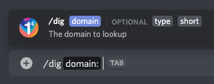
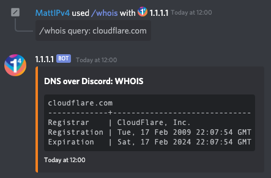
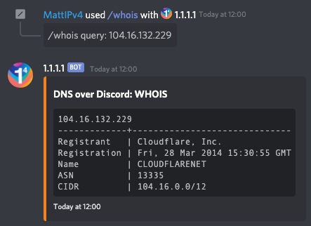
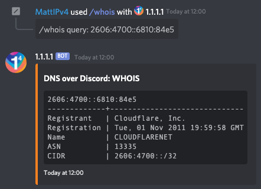
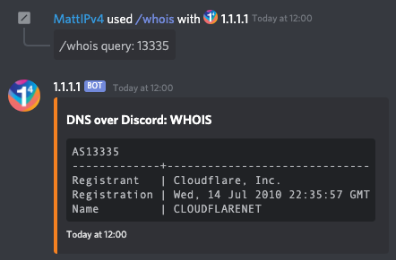

# DNS over Discord

**A 1.1.1.1 DNS resolver built for Discord**

*For the latest docs, please see [developers.cloudflare.com/1.1.1.1/fun-stuff/dns-over-discord](https://developers.cloudflare.com/1.1.1.1/fun-stuff/dns-over-discord)*

---

Ever wanted to make DNS requests from the comfort of your Discord server? Well now you can, thanks to the [@1.1.1.1 bot](https://dns-over-discord.v4.wtf/invite).

To start using the DNS over Discord bot, invite it to your Discord server using this link: [https://dns-over-discord.v4.wtf/invite](https://dns-over-discord.v4.wtf/invite)

## dig command

Once the bot is in your server, type `/dig` to begin using the bot's main command -- performing DNS lookups.
This will provide a native interface within Discord that allows you to specify the domain to lookup, an optional DNS record type and an optional flag for a short result.

If only a domain is given for the command, the bot will default to looking 'A' DNS records, and will return the full format result, not the short form.

### Supported record types

*   A
*   AAAA
*   CAA
*   CERT
*   CNAME
*   MX
*   NS
*   SPF
*   SRV
*   TXT
*   DNSKEY
*   DS
*   LOC
*   URI
*   HTTPS
*   NAPTR
*   PTR
*   SMIMEA
*   SOA
*   SSHFP
*   SVCB
*   TLSA

*To query multiple record types at once , use the `/multi-dig` command.*

### Examples

_`/dig domain: cloudflare.com`_

_`/dig domain: cloudflare.com type: AAAA short: True`_

## multi-dig command

Want to lookup multiple DNS record types at once?
The `/multi-dig` command allows you to specify any supported DNS record type, and multiple types separated by a space.

When providing DNS record types for the `/multi-dig` command, Discord will not prompt you with options.
Please provide a space-separated list of valid DNS record types to lookup, any invalid options will be silently dropped.
'A' records will be used as the default if no valid types are given.

### Supported record types

*   A
*   AAAA
*   CAA
*   CERT
*   CNAME
*   MX
*   NS
*   SPF
*   SRV
*   TXT
*   DNSKEY
*   DS
*   LOC
*   URI
*   HTTPS
*   NAPTR
*   PTR
*   SMIMEA
*   SOA
*   SSHFP
*   SVCB
*   TLSA

*Use '\*' (asterisk) in place of a record type to get DNS results for all supported types.*

### Examples

_`/multi-dig domain: cloudflare.com types: A AAAA`_

_`/multi-dig domain: cloudflare.com types: DNSKEY short: True`_

## whois command

Curious about who's behind a domain name, an IP address or even an ASN?
The `/whois` command allows you to perform an RDAP/WHOIS lookup right in Discord for a given domain, IP or ASN.

### Examples

_`/whois query: cloudflare.com`_

_`/whois query: 104.16.132.229`_

_`/whois query: 2606:4700::6810:84e5`_

_`/whois query: 13335`_

## Other commands

The bot also has a set of helper commands available to get more information about the bot and quick links.

### help command

The `/help` command provides in-Discord documentation about all the commands available in the 1.1.1.1 DNS over Discord bot.

_`/help`_

### privacy command

The `/privacy` command displays the privacy policy notice for using the 1.1.1.1 DNS over Discord bot.
This notice can also be viewed at [https://dns-over-discord.v4.wtf/privacy](https://dns-over-discord.v4.wtf/privacy).

_`/privacy`_

### github command

The DNS over Discord bot is open-source (here), and the `/github` command provides a quick link to access this GitHub repository.

_`/github`_

### invite command

The `/invite` command provides the user with a quick link to invite the 1.1.1.1 DNS over Discord bot to another Discord server.
The bot can be invited at any time with [https://dns-over-discord.v4.wtf/invite](https://dns-over-discord.v4.wtf/invite).

_`/invite`_

---

## Development

1. Create your test Discord application at https://discord.com/developers/applications (this does not need a bot account, just the application).
2. Create your `development.env` file. Copy `development.env.sample` and fill out the information from your Discord application, plus the ID of your test server/guild.
3. Authenticate with Wrangler by running `wrangler login`.
4. Update `wrangler.toml` for your account. Use `wrangler whoami` to get your account ID, update the value in `wranglar.toml` to match.
5. Develop with the worker by running `npm run dev`.

## Deployments

`wrangler.toml` and this repository is currently designed for a staging deployment and a production deployment.

Ensure that you've created and configured `staging.env` and `production.env` appropriately (`staging.env` has a test server/guild by default, but this can be removed to stage global commands).

Ensure that the staging/production environments in `wrangler.toml` have been updated with your zone IDs and routes for the workers.

Run `npm run publish:staging` to deploy to staging, and `npm run publish:production` to deploy to the production environment.

Live logs for both environments can be accessed with `npm run logs:staging` and `npm run logs:production` as needed.

<!-- Contributing -->
## Contributing

Contributions are always welcome to this project!\
Take a look at any existing issues on this repository for starting places to help contribute towards, or simply create your own new contribution to the project.

Please make sure to follow the existing standards within the project such as code styles, naming conventions and commenting/documentation.

When you are ready, simply create a pull request for your contribution and I will review it whenever I can!

### Donating

You can also help me and the project out by sponsoring me through [GitHub Sponsors](https://github.com/users/MattIPv4/sponsorship) (preferred), contributing through a [donation on PayPal](http://paypal.mattcowley.co.uk/) or by supporting me monthly on my [Patreon page](http://patreon.mattcowley.co.uk/).

    
    
    

<!-- Discussion & Support -->
## Discussion, Support and Issues

Need support with this project, have found an issue or want to chat with others about contributing to the project?
> Please check the project's issues page first for support & bugs!

Not found what you need here?

* If you have an issue, please create a GitHub issue here to report the situation, include as much detail as you can!
* _or,_ You can join our Slack workspace to discuss any issue, to get support for the project or to chat with contributors and myself:

