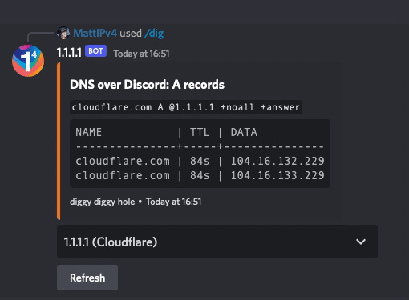
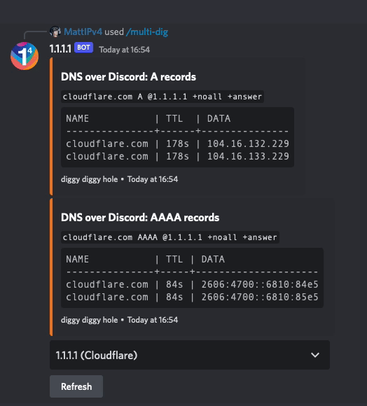

# DNS over Discord

**A 1.1.1.1 DNS resolver built for Discord**

*This documentation is also available on [Cloudflare's developer documentation site](https://developers.cloudflare.com/1.1.1.1/other-ways-to-use-1.1.1.1/dns-over-discord)*

---

1.1.1.1 works from a Discord server, thanks to the 1.1.1.1 bot. [Invite the bot to your Discord server](https://dns-over-discord.v4.wtf/invite) to start using DNS over Discord.

## Perform DNS lookups

Once the bot is in your server, type `/dig` to start performing DNS lookups. This will provide a native interface within Discord that allows you to specify the domain to lookup, an optional DNS record type and an optional flag for a short result.

If only a domain is given for the command, the bot will default to looking for `A` DNS records, and will return the full format result, not the short form.

Example:

```txt
/dig domain: cloudflare.com
```

### Supported record types

Discord has a limit of 25 options in slash commands, so DNS over Discord offers the 25 most common DNS record types to choose from.

<details>
<summary>Supported DNS record types</summary>
<div>

* `A`
* `AAAA`
* `CAA`
* `CDNSKEY`
* `CDS`
* `CERT`
* `CNAME`
* `DNSKEY`
* `DS`
* `HINFO`
* `HTTPS`
* `LOC`
* `MX`
* `NAPTR`
* `NS`
* `PTR`
* `SMIMEA`
* `SOA`
* `SPF`
* `SRV`
* `SSHFP`
* `SVCB`
* `TLSA`
* `TXT`
* `URI`

</div>
</details>

To query other DNS record types, or multiple record types at once, use the `/multi-dig` command.

### Short form response

DNS over Discord has an optional flag in the `/dig` command that allows the user to request a response in the short form.

When you request a response in the short form, the name and TTL columns will be excluded. The command only returns the data column without formatting, similar to the equivalent `dig` command-line interface response.

Example:

```txt
/dig domain: cloudflare.com type: AAAA records short: True
```

### Refreshing existing results

You can refresh the DNS lookup results by clicking the Refresh button. Clicking it will trigger the bot to re-request the DNS query in the message, and update the results in the message. Any user can click this button.

The refresh button is available on all responses to the `/dig` command, including those that resulted in an error, such as an unknown domain or no records found.

<div class="medium-img">


</div>

### Changing DNS provider

By default, the DNS over Discord bot uses Cloudflare's 1.1.1.1 DNS service. You can run the DNS lookup with alternate DNS providers by selecting the dropdown below the result. This shows you a list of available providers. Selecting a new provider updates the results in the message. Any user can change the DNS provider.

<details>
<summary>Supported DNS providers</summary>
<div>

* [1.1.1.1 (Cloudflare)](https://developers.cloudflare.com/1.1.1.1/)
* [1.1.1.2 (Cloudflare Malware Blocking)](https://developers.cloudflare.com/1.1.1.1/setup/#1111-for-families)
* [1.1.1.3 (Cloudflare Malware + Adult Content Blocking)](https://developers.cloudflare.com/1.1.1.1/setup/#1111-for-families)
* [8.8.8.8 (Google)](https://developers.google.com/speed/public-dns)
* [9.9.9.9 (Quad9)](https://www.quad9.net/)

</div>
</details>

<div class="medium-img">



</div>

## `multi-dig` command

If you want to look up multiple DNS record types at once, use the `/multi-dig` command. This allows you to specify any supported DNS record type, and multiple types separated by a space.

Example:

```txt
/multi-dig domain: cloudflare.com types: A AAAA
```

### Supported record types

When providing DNS record types for the `/multi-dig` command, Discord will not prompt you with options. You have to provide a space-separated list of valid DNS record types to lookup, as any invalid options will be silently dropped. `A` records will be used as the default if no valid types are given.

<details>
<summary>DNS record types supported and considered valid by the bot</summary>
<div>

Use a `*` (asterisk) in place of a record type to get DNS results for all supported types.

* `A`
* `AAAA`
* `AFSDB`
* `APL`
* `CAA`
* `CDNSKEY`
* `CDS`
* `CERT`
* `CNAME`
* `CSYNC`
* `DHCID`
* `DLV`
* `DNAME`
* `DNSKEY`
* `DS`
* `EUI48`
* `EUI64`
* `HINFO`
* `HIP`
* `HTTPS`
* `IPSECKEY`
* `KEY`
* `KX`
* `LOC`
* `MX`
* `NAPTR`
* `NS`
* `NSEC`
* `NSEC3`
* `NSEC3PARAM`
* `OPENPGPKEY`
* `PTR`
* `RP`
* `SMIMEA`
* `SOA`
* `SPF`
* `SRV`
* `SSHFP`
* `SVCB`
* `TA`
* `TKEY`
* `TLSA`
* `TXT`
* `URI`
* `ZONEMD`

</div>
</details>

### Short form response

Like the main `/dig` command, the `/multi-dig` command also supports the optional short flag after the types have been specified in the slash command.

Example:

```txt
/multi-dig domain: cloudflare.com types: CDS CDNSKEY short: True
```

### Refreshing existing results

The `/multi-dig` command also provides a refresh button below each set of DNS results requested (or after each block of 10 DNS record types, if you requested more than 10).

As with the `/dig` command, any user can press the refresh button to refresh the displayed DNS results, including for DNS queries that had previously failed.

<div class="medium-img">



</div>

### Changing DNS provider

Like the `/dig` command, you can change the DNS provider when using the `/multi-dig` command. The menu appears after each set of DNS results (or after each block of results if more than 10 record types are requested).

This menu can be used be any user to change the DNS provider used for the lookup.

<details>
<summary>Supported DNS providers</summary>
<div>

* [1.1.1.1 (Cloudflare)](https://developers.cloudflare.com/1.1.1.1/)
* [1.1.1.2 (Cloudflare Malware Blocking)](https://developers.cloudflare.com/1.1.1.1/setup/#1111-for-families)
* [1.1.1.3 (Cloudflare Malware + Adult Content Blocking)](https://developers.cloudflare.com/1.1.1.1/setup/#1111-for-families)
* [8.8.8.8 (Google)](https://developers.google.com/speed/public-dns)
* [9.9.9.9 (Quad9)](https://www.quad9.net/)

</div>
</details>

<div class="medium-img">


</div>

## `whois` command

The `/whois` command allows you to perform a RDAP/WHOIS lookup right in Discord for a given domain, IP or ASN.

Examples:

```txt
/whois query: cloudflare.com
/whois query: 104.16.132.229
/whois query: 2606:4700::6810:84e5
/whois query: 13335
```

## Other commands

The bot also has a set of helper commands available to get more information about the bot and quick links.

### `help` command

The `/help` command provides in-Discord documentation about all the commands available in the 1.1.1.1 DNS over Discord bot.

Example:

```txt
/help
```

### `privacy` command

The `/privacy` command displays the Privacy Policy notice for using the 1.1.1.1 DNS over Discord bot. You can also [refer to the Privacy Policy page](https://dns-over-discord.v4.wtf/privacy) to access it.

Example:

```txt
/privacy
```

### `terms` command

The `/terms` command displays the Terms of Service notice for using the 1.1.1.1 DNS over Discord bot. You can also [refer to the Terms of Service page](https://dns-over-discord.v4.wtf/terms) to access it.

Example:

```txt
/terms
```

### `github` command

The DNS over Discord bot is open-source, and the `/github` command provides a quick link to access the GitHub repository. The GitHub repository can be accessed at [https://github.com/MattIPv4/DNS-over-Discord/](https://github.com/MattIPv4/DNS-over-Discord/).

Example:

```txt
/github
```

### `invite` command

The `/invite` command provides the user with a quick link to invite the 1.1.1.1 DNS over Discord bot to another Discord server.
The bot can be invited at any time with [https://dns-over-discord.v4.wtf/invite](https://dns-over-discord.v4.wtf/invite).

```txt
/invite
```

<!--
# When in Cloudflare docs:

- Use `https://cfl.re/3nM6VfQ` instead of `https://dns-over-discord.v4.wtf/invite`
- Use `/1.1.1.1/static/dns-over-discord/*` instead of `assets/commands/*`
- Include development foot note as below:

```txt
---

## Development

The DNS over Discord bot is deployed on [Cloudflare Workers](https://workers.cloudflare.com/).

You can find the source code for the bot on GitHub, as well as information on getting started with contributing to the project, at [https://github.com/MattIPv4/DNS-over-Discord/](https://github.com/MattIPv4/DNS-over-Discord/).
```

# Generating the types lists:

```txt
node

> const { VALID_TYPES } = await import('./src/utils/dns.js');
> console.log(VALID_TYPES.slice(0, 25).map(type => `* \`${type}\``).join('\n'));
> console.log(VALID_TYPES.map(type => `* \`${type}\``).join('\n'));
```

# Generating the providers lists:

```txt
node

> const { default: providers } = await import('./src/utils/providers.js');
> console.log(providers.map(({ name, info }) => `* [${name}](${info})`).join('\n'));
```
-->

---

## Development

1. Create your test Discord application at https://discord.com/developers/applications (this does not need a bot account, just the application).
2. Create your `development.env` file. Copy `development.env.sample` and fill out the information from your Discord application, plus the ID of your test server/guild.
3. Authenticate with Wrangler by running `wrangler login`.
4. Update `wrangler.toml` for your account.
   - Use `wrangler whoami` to get your account ID, update the value in `wrangler.toml` to match.
   - Use `wrangler kv:namespace create "CACHE"` to create the KV namespace, update the `id` and `preview_id` in `wrangler.toml` to match.
5. Develop with the worker by running `npm run dev`.
6. (Optional) Start an HTTP tunnel to your local development server by running `npm run tunnel`, using [cloudflared](https://developers.cloudflare.com/cloudflare-one/connections/connect-apps/run-tunnel/trycloudflare).

## Deployments

`wrangler.toml` and this repository is currently designed for a staging deployment and a production deployment.

Ensure that you've created and configured `staging.env` and `production.env` appropriately (`staging.env` has a test server/guild by default, but this can be removed to stage global commands).

Ensure that the staging/production environments in `wrangler.toml` have been updated with your zone IDs and routes for the workers.

Ensure that the KV namespaces are created for staging/production environments and are configured in `wrangler.toml`.
Use `wrangler kv:namespace create "CACHE" --env <staging/production>`.

To deploy from local, run `npm run publish:staging` to deploy to staging, and `npm run publish:production` to deploy to the production environment.

To deploy using GitHub, run `make deploy-staging` to force push and deploy to staging, and `make deploy-production` to force push and deploy to the production environment.

Live logs for both environments can be accessed with `npm run logs:staging` and `npm run logs:production` as needed.

<!-- Contributing -->
## Contributing

Contributions are always welcome to this project!\
Take a look at any existing issues on this repository for starting places to help contribute towards, or simply create your own new contribution to the project.

Please make sure to follow the existing standards within the project such as code styles, naming conventions and commenting/documentation.

When you are ready, simply create a pull request for your contribution and I will review it whenever I can!

### Donating

You can also help me and the project out by sponsoring me through [GitHub Sponsors](https://github.com/users/MattIPv4/sponsorship) (preferred), contributing through a [donation on PayPal](http://paypal.mattcowley.co.uk/) or by supporting me monthly on my [Patreon page](http://patreon.mattcowley.co.uk/).
<p>
    <a href="https://github.com/users/MattIPv4/sponsorship" target="_blank">
        
    </a>
    <a href="http://patreon.mattcowley.co.uk/" target="_blank">
        
    </a>
    <a href="http://paypal.mattcowley.co.uk/" target="_blank">
        
    </a>
</p>

<!-- Discussion & Support -->
## Discussion, Support and Issues

Need support with this project, have found an issue or want to chat with others about contributing to the project?
> Please check the project's issues page first for support & bugs!

Not found what you need here?

* If you have an issue, please create a GitHub issue here to report the situation, include as much detail as you can!
* _or,_ You can join our Slack workspace to discuss any issue, to get support for the project or to chat with contributors and myself:

<a href="http://slack.mattcowley.co.uk/" target="_blank">
    
</a>
